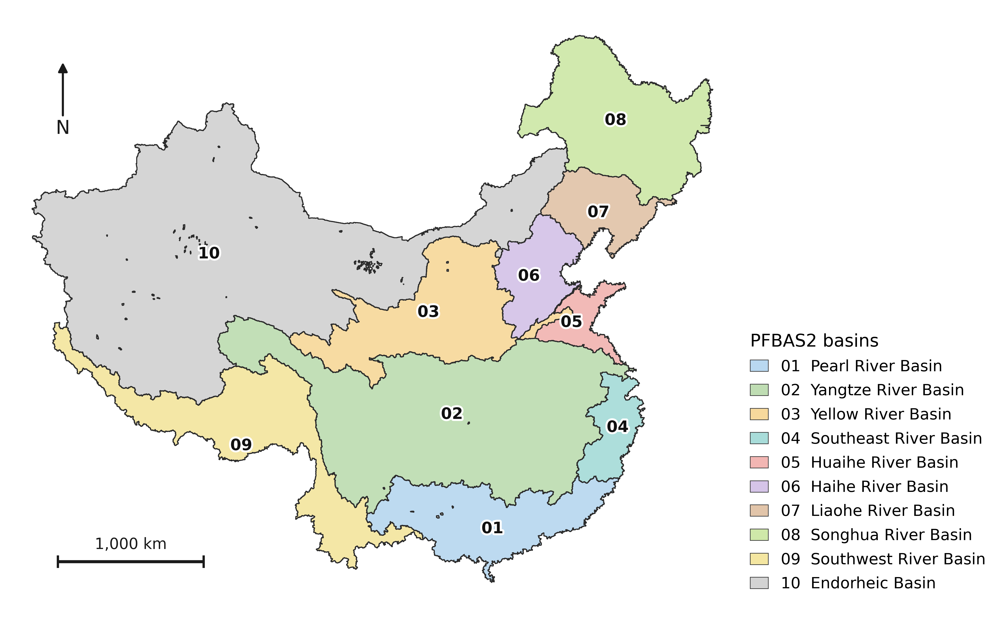

# ParFlow CONCN Share Platform  
**本平台用于共享中国大陆尺度ParFlow-CONCN模型。**  

ParFlow-CONCN 1.0模型是约1公里水平分辨率，纵深492m的地表水-地下水集成水文模型。1.1版本正在建设中，可与CLM或CoLM耦合运行，用于探究地下水与陆面过程的双向交互作用。  

用户可通过本平台裁剪用于目标流域ParFlow模拟的所有基础输入文件，如：流域mask文件、初始压力场分布、水平x、y方向坡度文件、manning粗糙系数、含水介质水力参数、基岩深度、用于不规则流域模拟的solid文件等。  

**若您使用了本工具及生成的文件用于生产、研究，请引用：**  
Yang C, Jia ZT, Xu WJ, Wei ZW, Zhang XL, Zou YG, Mcdonnell JJ, Condon LE, Dai YJ, Maxwell RM, 2025. CONCN: a high-resolution, integrated surface water-groundwater ParFlow modeling platform of continental China. Hydrology and Earth System Sciences, 29(9): 220-2218.  
## CONCN 流域分级

CONCN流域分级使用 14 位固定编码体系来表示，每升一级增加 2 位有效数字，剩余位数以 0 填充。



| 级别 | 有效位数 | 流域数量 | 说明 |
|------|----------|----------|------|
| PFBAS2 | 2 位 | 10 个 | 一级流域 |
| PFBAS4 | 4 位 | 127 个 | 二级子流域 |
| PFBAS6 | 6 位 | 367 个 | 三级子流域 |
| PFBAS8 | 8 位 | 1,215 个 | 四级子流域 |
| PFBAS10 | 10 位 | 3,988 个 | 五级子流域 |
| PFBAS12 | 12 位 | 12,118 个 | 六级子流域 |
| PFBAS14 | 14 位 | 53,040 个 | 七级子流域  |

| 级别 | 有效位数 | 编码示例 | 说明 |
|------|---------|---------|------|
| PFBAS2 | 2位 | `01000000000000` | 第1个一级流域 |
| PFBAS4 | 4位 | `01020000000000` | 01流域的第2个子流域 |
| PFBAS6 | 6位 | `01020300000000` | 0102流域的第3个子流域 |
| PFBAS8 | 8位 | `01020301000000` | 010203流域的第1个子流域 |
| PFBAS10 | 10位 | `01020301040000` | 01020301流域的第4个子流域 |
| PFBAS12 | 12位 | `01020301040500` | 0102030104流域的第5个子流域 |
| PFBAS14 | 14位 | `01020301040506` | 010203010405流域的第6个子流域 |
## 项目结构如下：

```
ParFlow-CONCN-Share-Platform/
├── setup.py
├── environment.yaml
├── README.md
└── concnshare/
  ├── init.py
  ├── run_two.py
  ├── generate_mask.py
  └── crop_pfb.py
```

## 安装与使用

### 1. 克隆仓库

```
git clone https://github.com/ParFlowCommunity/ParFlow-CONCN-Share-Platform
```

### 2. 进入代码目录

```bash
cd ParFlow-CONCN-Share-Platform
```

### 3. 创建 Conda 环境

```bash
conda env create -f environment.yaml
```

### 4. 激活环境

```bash
conda activate concnshare
```

### 5. （可选）自定义输出目录

默认输出目录为 `/ParFlow-CONCN-Share-Platform/outputs/`。如需更改，请设置环境变量：

```bash
export OUTPUT_DIR=/your/custom/path
```

### 6. 运行程序

```bash
run_two
```

按提示输入14位流域编码（如 `01010105000000`）即可开始处理。

## 输出文件

- `outputs/mask.tif`：二值掩膜 GeoTIFF
- `outputs/mask.pfb`：掩膜 PFB 文件
- `outputs/pos.json`：位置信息
- `outputs/<流域编码>.vtk` / `outputs/<流域编码>.pfsol`：域文件
- `outputs/slopex.<流域编码>.pfb` 等：裁剪后的 PFB 文件

## 环境变量

- `OUTPUT_DIR`：指定输出目录（默认为 `./outputs`）

## 注意事项

- 本工具仅支持 Linux 系统，需要预先安装 Conda。
- 如果使用的是默认的`outputs`输出文件夹，运行代码时需`cd`到`outputs`的上级文件夹。

## 问题反馈

请将问题提交至 GitHub Issues。
